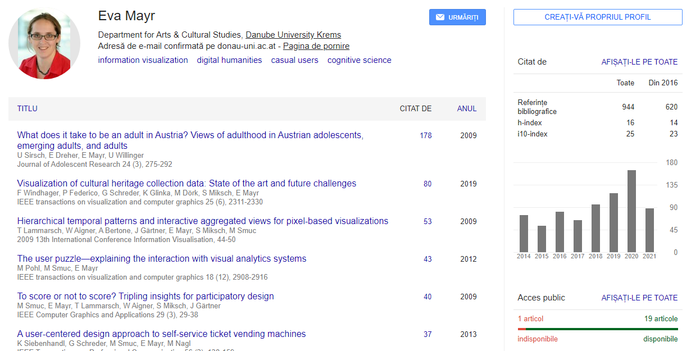
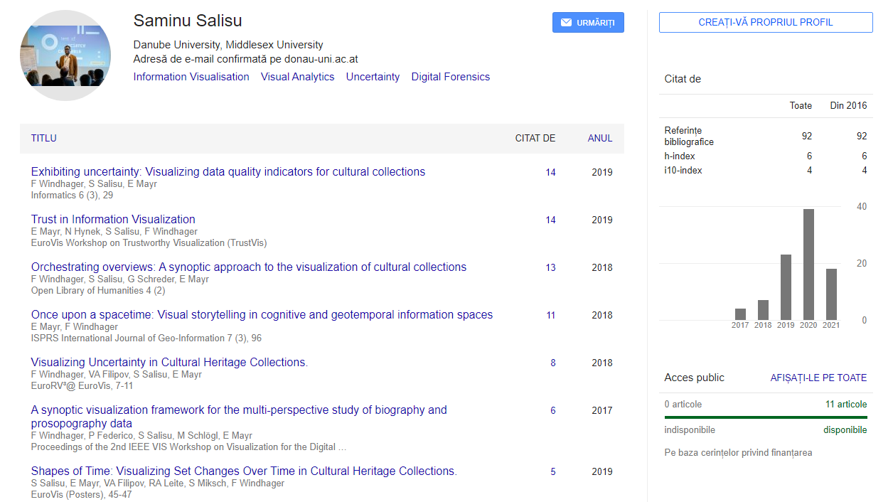
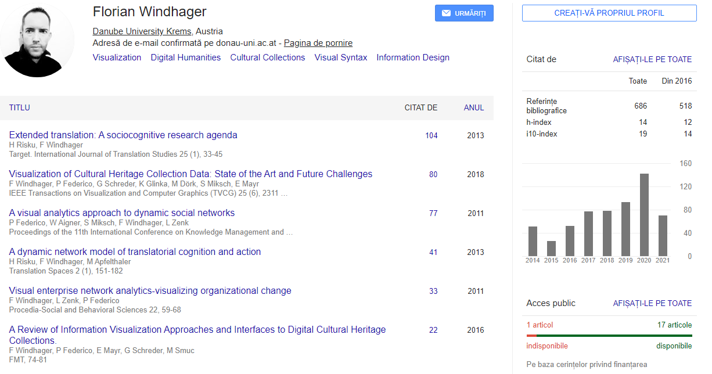

---
editor_options:
markdown:
wrap: 80
---

# Trust in Information Visualization

-   Danube University Krems

    -   E. Mayr

    -   N. Hynek

    -   S. Salisu

    -   F. Windhager

### Author Keywords: `Uncertainty`; `visualization`; `information aggregation`; `visualisation design`;`information aggregation`;`trust`; `InfoVis`; {.unnumbered}

Trust is an important factor that mediates whether a user will rely and build on the information displayed in a visualization. Research in other fields shows that there are different mechanisms of trust building: Users might elaborate the information deeply and gain a good understanding of the uncertainties in the data and quality of the information. But they might also use superficial cues as indicators for trust. Which processes are activated depends on the trustworthiness on the side of the visualization and on the trust perception by the users. We lay out challenges for future research to further improve our understanding of trust in information visualization.[@mayr2019trust]

## Evaluate the authority or background of the author {#evaluate-the-authority-or-background-of-the-author author=""}

## Comment on the intended audience {#comment-on-the-intended-audience audience=""}

The audience for the article are both academic and business audience alike. It favors professionals that work with data visualization and trust perception.

## Compare or contrast this work with another you have cited {#compare-or-contrast-this-work-with-another-you-have-cited compare=""}

This paper investigates different sides of the information visualization. One one side there is the information presentation and on the other there is the users perception.

## Explain how this work illuminates your bibliography topic {#explain-how-this-work-illuminates-your-bibliography-topic explain=""}

In our veracity investigation we make use of visuals to track and explain where a possible issue might arise. This paper identifies several factors on the the user and on the visualization side that can influence trust. It all leads to a better foundation of trust in InfoVis in the future.
