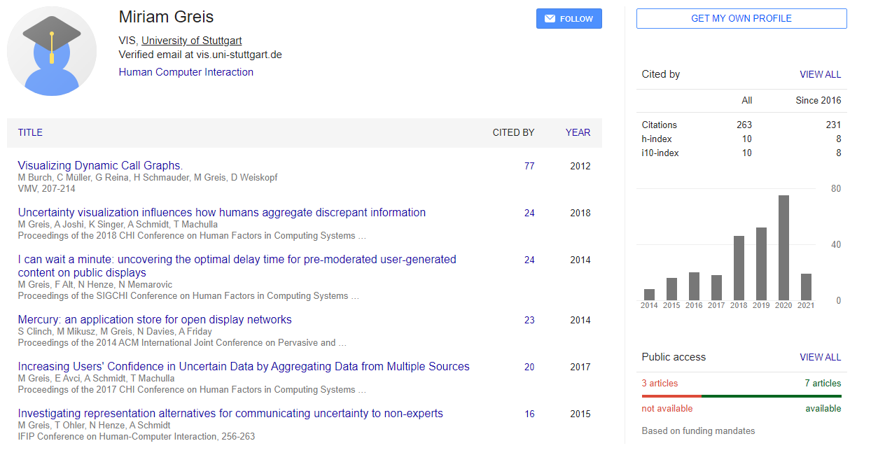

---
editor_options:
markdown:
wrap: 80
---

# Uncertainty Visualization Influences how Humans Aggregate Discrepant Information

-   University of Stuttgart, Germany

    1.  Miriam Greis

    2.  Ken Singer

    3.  Tonja Machulla

-   Olin College of Engineering, Needham MA, US

    1.  Aditi Joshi

-   LMU Munich, Munich, Germany

    1.  Albrecht Schmidt

### Author Keywords: `Uncertainty`; `visualization`; `information aggregation`; `conflicting information`;{-}

The number of sensors in our surroundings that provide the same information steadily increases. Since sensing is prone to errors, sensors may disagree. For example, a GPS-based tracker on the phone and a sensor on the bike wheel may provide discrepant estimates on traveled distance. This poses a user dilemma, namely how to reconcile the conflicting information into one estimate. We investigated whether visualizing the uncertainty associated with sensor measurements improves the quality of users' inference. We tested four visualizations with increasingly detailed representation of uncertainty. Our study repeatedly presented two sensor measurements with varying degrees of inconsistency to participants who indicated their best guess of the "true" value. We found that uncertainty information improves users' estimates, especially if sensors differ largely in their associated variability. Improvements were larger for information-rich visualizations. Based on our findings, we provide an interactive tool to select the optimal visualization for displaying conflicting information.[@greis2018uncertainty]

## Evaluate the authority or background of the author {#evaluate-the-authority-or-background-of-the-author author=""}

## Comment on the intended audience {#comment-on-the-intended-audience audience=""}

The audience for the article are both academic and business audience alike. It favors professionals that work with data visualization.

## Compare or contrast this work with another you have cited {#compare-or-contrast-this-work-with-another-you-have-cited compare=""}

This paper investigates different strategies to reconcile measurements that do not seem to provide the same result.

1.  ignore the sensor that does not align with measurement from the app

2.  arithmetic mean of the two sensor measurements

3.  weighted average of the two measurements for more reliable device to have a stronger influence on the user's estimate

## Explain how this work illuminates your bibliography topic {#explain-how-this-work-illuminates-your-bibliography-topic explain=""}

In our veracity investigation we make use of visuals to track and explain where a possible issue might arise. Like with everything data related there are many ways in which data can be misleading. From the data itself not being adequate for specific highlighted issue to the visualization technique used.

The goal of this work is investigate and understand how different uncertainty visualizations influence humans in aggregating conflicting probabilistic data.

1\. We show that humans aggregate conflicting information differently if they have access to ***uncertainty information***. They do not build a simple average, but rather weigh each source of information taking its reliability into account.

2\. We show that the ***amount of uncertainty information*** included in a visualization influences the internal models humans use for combining information.

3\. Based on our findings, we provide an ***interactive tool*** that aids interface designers in the ***selection of uncertainty visualizations*** best suited to improve users' inference.
