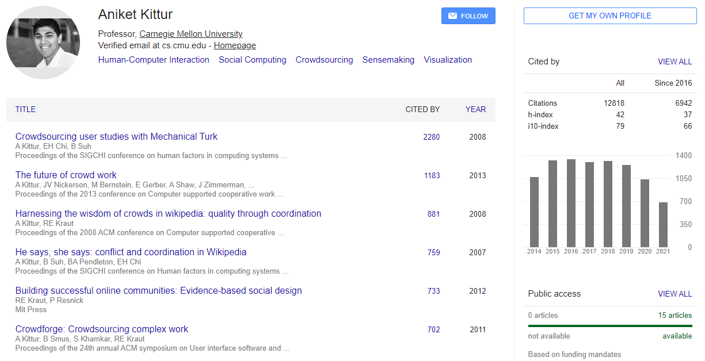
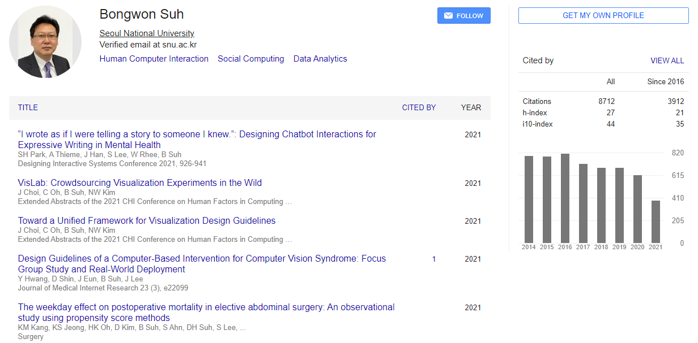
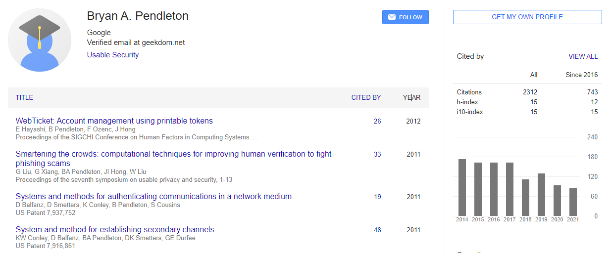

# He Says, She Says: Conflict and Coordination in Wikipedia

-   University of California, Los Angeles 1285 Franz Hall, CA, 90095 USA

1.  Aniket Kittur

-   Palo Alto Research Center Inc. 3333 Coyote Hill Road, CA 94304 USA

1.  Bongwon Suh

2.  Bryan A. Pendleton

3.  Ed H. Chi

Wikipedia, a wiki-based encyclopedia, has become one of the most successful experiments in collaborative knowledge building on the Internet. As Wikipedia continues to grow, the potential for conflict and the need for coordination increase as well. This article examines the growth of such non-direct work and describes the development of tools to characterize conflict and coordination costs in Wikipedia. The results may inform the design of new collaborative knowledge systems.

### Author Keywords: `Wikipedia`; `colaboration`; `conflict`; `web-based interaction`;`visualization`; {-}

## Evaluate the authority or background of the author

## Comment on the intended audience

The audience for the article are both academic and business audience alike. It favors professionals that work with data visualization.

## Compare or contrast this work with another you have cited

This article explores the topic of computer mediated communication systems. Much like other articles it focus it is the online Wikipedia website used to discuss and articulate procedures such as conflict resolution

## Explain how this work illuminates your bibliography topic.

The article highlights general implications for strategies of dealing with conflict. The more people involved has the potential for reducing conflict. Another item of interest to is is the ability for serious anonymous contributors to discuss articles may outweigh the risks of controversies and the need to provide protection for minority opinions expressed through anonymity.
