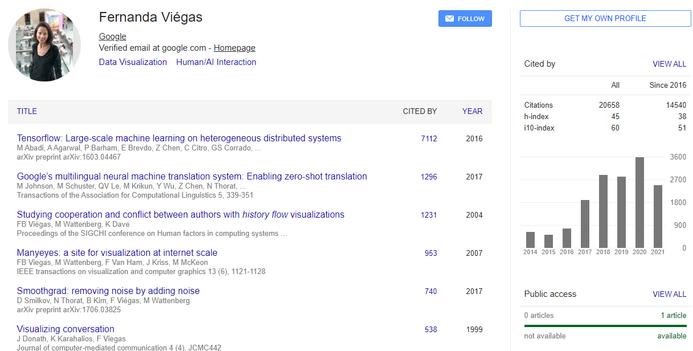
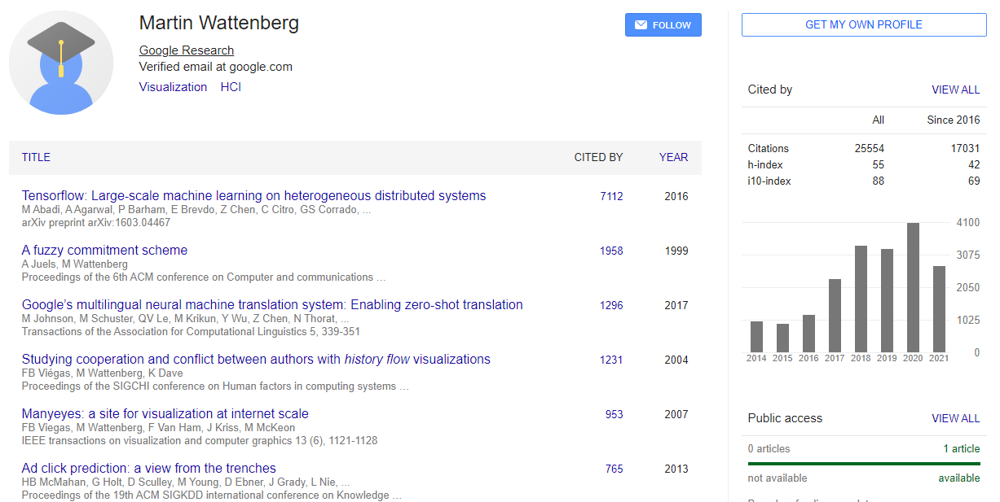
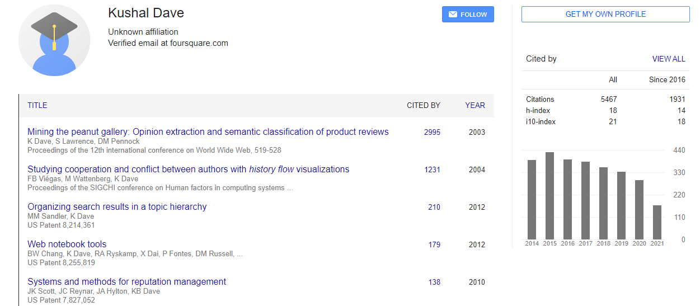

# Studying Cooperation and Conflict between Authors with history flow Visualizations

-   MIT Media Lab Cambridge, MA 02139 USA

    1.  Fernanda B. Viégas

-   IBM Research Cambridge, MA 02142 USA

    1.  Martin Wattenberg

    2.  Kushal Dave

The Internet has fostered an unconventional and powerful style of collaboration: "wiki" web sites, where every visitor has the power to become an editor. In this paper we investigate the dynamics of Wikipedia, a prominent, thriving wiki. We make three contributions. First, we introduce a new exploratory data analysis tool, the history flow visualization, which is effective in revealing patterns within the wiki context and which we believe will be useful in other collaborative situations as well. Second, we discuss several collaboration patterns highlighted by this visualization tool and corroborate them with statistical analysis. Third, we discuss the implications of these patterns for the design and governance of online collaborative social spaces. We focus on the relevance of authorship, the value of community surveillance in ameliorating antisocial behavior, and how authors with competing perspectives negotiate their differences.[@viegas2004studying]

### Author Keywords: `Wikipedia`; `wiki`; `revert`; `collaboration`; `user model`; `visualization`; `information`; `document`; {-}

## Evaluate the authority or background of the author

## Comment on the intended audience

The audience for the article are both academic and business audience alike. It favors professionals that work with technologies that makes use of *history flow visualization*.

## Compare or contrast this work with another you have cited

This is the third article of its kind that studies how reverts happen on an online wiki. It studies collaboration patterns using several visualization techniques that plot the reverts of an article based on groups. The authorship and the value of community surveillance that leads to ameliorating antisocial behavior, in other words digital vandalism, when competing for different perspective on the topic.

## Explain how this work illuminates your bibliography topic

The article presents different visualizations techniques that highlight the different behavior patterns. It used history flow as area charts that were equally spaced, grouped by users individually or used date revision to space out the visual. In a conflict resolution ultimately it comes down to community introspection with the scope of talking to each other about contributions and reaching a consensus.
