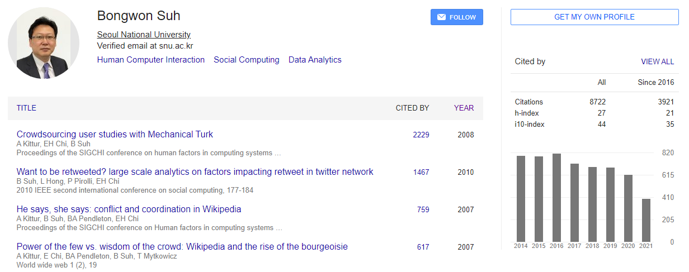
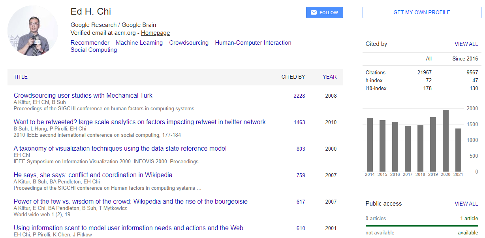

# Us vs. Them: Understanding Social Dynamics in Wikipedia with Revert Graph Visualizations

-   Palo Alto Research Center

    1.  Bongwon Suh

    2.  Ed H. Chi

    3.  Bryan A. Pendleton

    4.  Aniket Kittur

### Author Keywords: `Wikipedia`; `wiki`; `revert`; `graph`; `collaboration`; `user model`; `visualization`; `information`; `interfaces`; `group`; `organization`; `interfaces`; `collaborative`; `computing`; `computer-supported cooperative work`; `Web-based interaction` {.unnumbered}

Wikipedia is a wiki-based encyclopedia that has become one of the most popular collaborative on-line knowledge systems. As in any large collaborative system, as Wikipedia has grown, conflicts and coordination costs have increased dramatically. Visual analytic tools provide a mechanism for addressing these issues by enabling users to more quickly and effectively make sense of the status of a collaborative environment. In this paper we describe a model for identifying patterns of conflicts in Wikipedia articles. The model relies on users' editing history and the relationships between user edits, especially revisions that void previous edits, known as "reverts". Based on this model, we constructed Revert Graph, a tool that visualizes the overall conflict patterns between groups of users. It enables visual analysis of opinion groups and rapid interactive exploration of those relationships via detail drilldowns. We present user patterns and case studies that show the effectiveness of these techniques, and discuss how they could generalize to other systems.[@suh2007us]

## Evaluate the authority or background of the author

## Comment on the intended audience

The audience for the article are both academic and business audience alike. It favors professionals that work with technologies that makes use of *history flow visualization*.

## Compare or contrast this work with another you have cited

This article is focusing on emerging patterns from collaborative knowledge systems like Wiki. The author highlights the formations of patterns groups that begin with an opinion group that then forms the mediation group that begins to defend the specific point of view and ends with a third pattern that focuses on fighting vandalism. There are other patterns like the Controversial editor that just seeks to create high degree of conflict.

## Explain how this work illuminates your bibliography topic

The article is great for pointing out emerging patterns that happen when humans get together in a digital space and have to negotiate the common interaction and the resolution of conflict.
