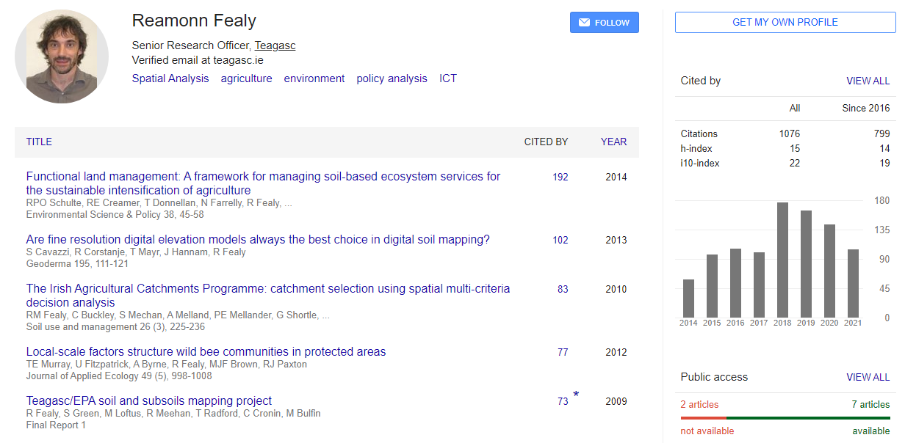

# Teagasc-EPA Soils and Subsoils Mapping Project

-   teagasc

    1.  Réamonn Fealy

The National Soil Survey was initiated in 1959, shortly after the
establishment of An Foras Talúntais the precursor organisation to
Teagasc. During the period of operation of the NSS, a number of soil
survey outputs were produced at varying scales. At its close in the
1980s, detailed reconnaissance mapping of 44% of the country had been
completed with resulting maps published at 1:126,720 scale. To meet the
guidance on the requirement of knowledge on the overlying strata, a key
recommendation of the Groundwater Working Group proposed that the
Spatial Analysis Unit at Teagasc, Kinsealy produce soils and subsoils
maps for the entire country using a consistent, standardised method. As
less than half of the country's soils had been surveyed and published
and due to the constrained timeline for development the necessity of
incorporating remote sensing and Geographical Information System (GIS)
techniques into the project methodology was immediately apparent. This
objective was met by extending the research and mapping efforts as
specified and delivered under the previous FIPS-Irish Forest Soils
project to the remaining areas of the country which were not previously
mapped by that project.[@fealy2009teagasc]

### Author Keywords: `Measurement`; `TOPOGRAPHY`; `LAND USE`; `County`;`TEXTURAL CRITERIA`; `WATER TABLE`; `DESCRIPTION`; `LABORATORY ANALYSIS`; `PARTICLE SIZE`; `HCI`; `Research methods`; `Modeling`; `Summary`; {.unnumbered}

## Evaluate the authority or background of the author

## Comment on the intended audience

The audience for the article are both academic and business audience
alike. It favors professionals that work with technologies that
geostatistical techniques.

## Compare or contrast this work with another you have cited

This technical article is looking at how presenting a map associated
with your data presents a context behind the facts. The scientific rigor
starts with field measurement that then get exported and processed into
beautiful and informative maps.

## Explain how this work illuminates your bibliography topic

The technical article informs how to use geodesic data to reinforce the
provenance of soil minerals that then go in to nurture the plants that
feed the bees.
