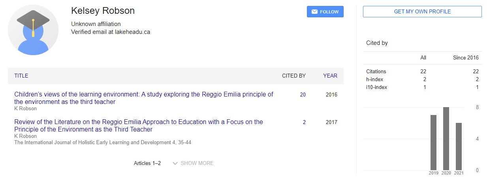
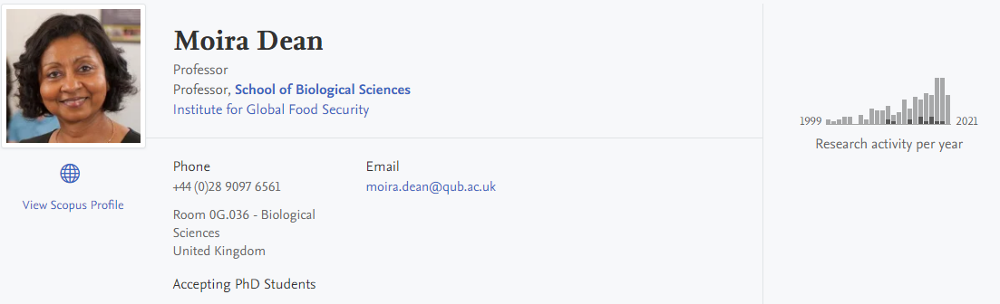
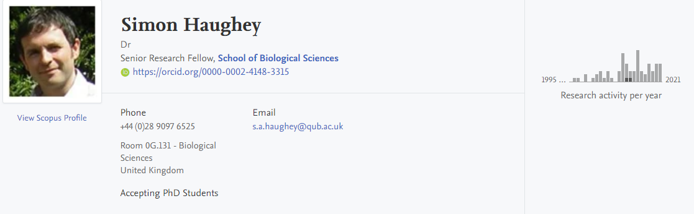
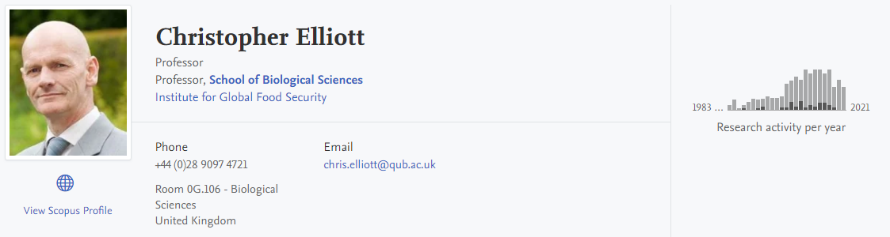

---
editor_options:
markdown:
wrap: 80
---

# Uncertainty Visualization Influences how Humans Aggregate Discrepant Information

-   ABP Food Group, John St, Mulladrillen, Ardee, Co. Louth, A92 C92H, Ireland

    1.  Kelsey Robson

-   Queens University Belfast, Institute for Global Food Security, Biological Sciences Building

    1.  Kelsey Robson

    2.  Moira Dean

    3.  Simon Haughey

    4.  Christopher Elliott

### Author Keywords: `Uncertainty`; `visualization`; `information aggregation`; `conflicting information`; {.unnumbered}

Due to constant integrity challenges, ambiguous definitions, and lack of specific guidance, the food industry has been left vulnerable to food fraud. Food fraud is undefined by the EU, resulting in the creation of varying definitions from researchers and regulatory bodies. Not having a definition of food fraud and related terms makes it challenging to comprehend, communicate and ideate on how to prevent it. Furthermore, the food industry is lacking clear guidance on the prevention and mitigation of food fraud. Several documents are available to help guide the food industry; however, they are nonspecific to supply chains, which has left a substantial gap in knowledge that is necessary to protect the food supply. This review analyzed definitions for food fraud and related terms, as well as current guidance on food fraud prevention and mitigation, which can be utilized by the food industry to find commonality and assess where more information is needed. An abundance of literature describing food fraud was found, and although definitions varied, the common themes of intentional acts and economic motivation were widespread. Additionally, general guidance documents for food fraud mitigation and prevention shared general ideas of supply chain transparency, supplier audits, horizon scanning, and vulnerability assessment, which could be utilized throughout the food industry.[@robson2021comprehensive]

## Evaluate the authority or background of the author {#evaluate-the-authority-or-background-of-the-author author=""}

## Comment on the intended audience {#comment-on-the-intended-audience audience=""}

The audience for the article are both academic and business audience alike. It favors professionals that work with food fraud and food industry.

## Compare or contrast this work with another you have cited {#compare-or-contrast-this-work-with-another-you-have-cited compare=""}

This paper investigates different strategies to fully comprehend and form clear communication surrounding food fraud and how to prevent it. More important is the clarity on how food fraud can occur in specific supply chains. This in turn will provide the food industry with the knowledge to help with prevention and mitigate fraud.

## Explain how this work illuminates your bibliography topic {#explain-how-this-work-illuminates-your-bibliography-topic explain=""}

In our veracity investigation we will investigate how food fraud prevention and mitigation can be addressed with the help of transparent supply chain and visualization at the customer side.
